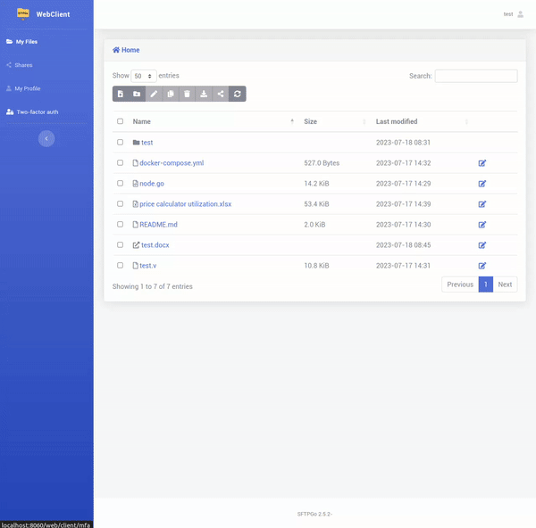
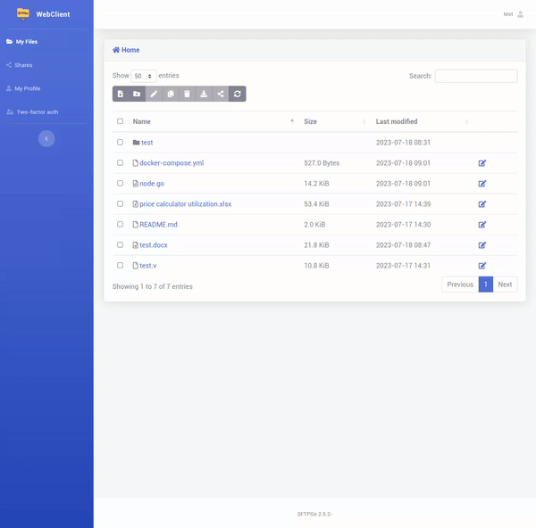

# SFTPGO integration

[Sftpgo](https://github.com/drakkan/sftpgo) is a SFTP web server with HTTP and webdav support. This server is integrated in web3 proxy, providing a simple to use web client that allows users to manage and share their files.

The integration is done through our own fork of the project found [here](https://github.com/freeflowuniverse/aydo). This integration build on what is already available and add additional features, the following have been added so far:

- Allowing editing of office documents through the web client via OnlyOffice document server integration
- Adding syntax highlighting in the code editor for Golang, Vlang, Yaml and Markdown.
- Implementing a HTTP client to the SFTPGO API using Vlang
- Extending the hooks system functionality by adding the pre-lsdir sync Fs action. This action allows you to execute an http service or an external command before listing the directory content. If the external command completes with a zero exit status or the HTTP notification response code is 200, SFTPGo will allow the operation, otherwise the client will get a permission denied error.

You can start the server by using either one of the following two methods described below:

- Using docker compose(recommended way)
- Enabling SFTPGO in the server binary

## Using docker compose

This requires a linux machine as a host.

To have everything up and running, you can use `docker-compose` to start the necessary comopenents:

- web proxy with sftpgo
- document server

This is done by running:

```bash
docker-compose up -d
```

This creates the admin with the credentials available in the docker compose [env](../../../.env) file. To configure it, expose the env variables as described above.

Sftpgo server should be accessible through <http://localhost:8060/web/admin/login> where you will be prompted to login using the admin credentials.
Once logged in the admin can now add users to the server and log as one of those users through this [link](http://localhost:8060/web/client/login).

## Enabling the server

You need to first clone our [fork](https://github.com/freeflowuniverse/aydo) of SFTPGO, since it hosts needed template and static files.

Then you need to have an instance of OnlyOffice Document [server](https://github.com/ONLYOFFICE/DocumentServer) running. This can be done using the official docker image:

```bash
docker run -i -t -d -p 8016:80 -e JWT_ENABLED=false onlyoffice/documentserver:7.3
```

In this instance the Document server would be accessible through <http://localhost:8016>

To start the server you need to pass the following command argument to the web proxy binary, make sure to check [docs](../../../README.md) for how to generate and run the binary:

```bash
-sftp-config-dir {sftpgodir}
```

Where `sftpgodir` is the directory that will contain the secrets generated by the server during the initial start. Most importantly the directory should include `sftpgo.json` which configures the server.

There is a config file at the root of the repo that can be used, although it might be necessary to change the following sections:

- `httpd.templates_path`: this should point to the absolute templates path used by SFTPGO to generate the UI. This usually can be found at the root of the sftpgo fork
- `httpd.static_files_path`: this points to the absolute path of additional static files needed for the UI, should also be in the root of the fork
- `data_provider.name`: path for the sqlite DB file that would be created if not already there, required
- `data_provider.users_base_dir`: absolute path to hold the users data, required
- `smtp.templates_path`: this should point to the absolute templates path used by SFTPGO to generate the UI. This usually can be found at the root of the sftpgo fork

In addition to the above configuration the following env variables need to be specified:

- `SFTPGO_DEFAULT_ADMIN_USERNAME`: the admin username for the admin created in initial startup
- `SFTPGO_DEFAULT_ADMIN_PASSWORD`: the admin password for the admin created in initial startup
- `SFTP_SERVER_ADDR`: The address on which the sftpgo server is reachable to both the user and the OnlyOffice service container, this is needed for the only office document server integration thus the address needs to be exposed to it for example: <http://172.17.0.1:8060>
- `ONLYOFFICE_SERVER_ADDR`: The address for document server address, this is used to import the necessary javascript module to use the document server API and needs to be reachable by the web client for example: <http://localhost:8016>

## `pre-lsdir` Sync Fs Action

We have provided an example bash script to automate the creation of a demo user account and the setup of predefined event action and rule.
Additionally, we have added a working V lang server to receive Fs events notifications from sftpgo.
You can find the instructions on how to use this example here: https://github.com/freeflowuniverse/aydo/tree/development/examples/web-hook

## Additional Features

As mentioned above this project is built on what already exists in SFTPGO plus some additional Features. these features are:

### Editing Documents via OnlyOffice

The user can now edit documents using OnlyOffice and it supports different document extensions like (.docx, .xlsx, etc...)

To edit a document via only office you simply need to click on the edit icon next to the desired file and that's it.


after that you will be redirected to OnlyOffice and have full access to its functionality.



### Code Editor and Syntax Highlighting

Code editing and syntax highlighting was also added for the following languages (Golang, Vlang, Yaml and Markdown) all you have to do is click on the edit icon next to the desired file and you will be redirected to the code editor.



